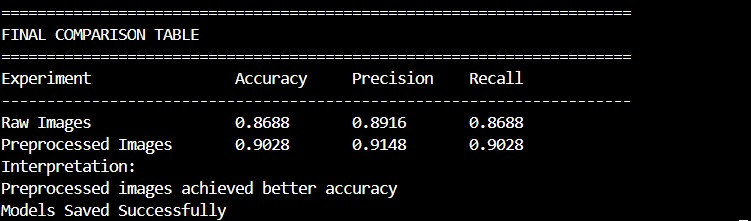
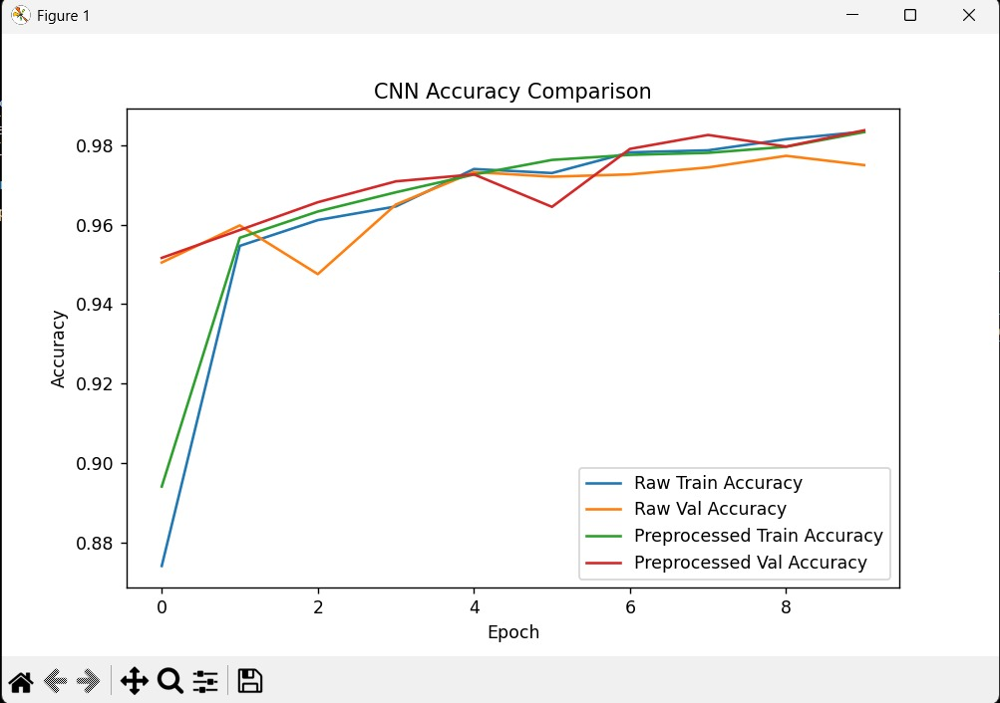
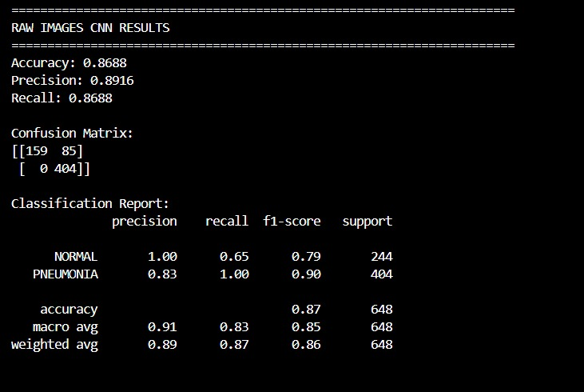
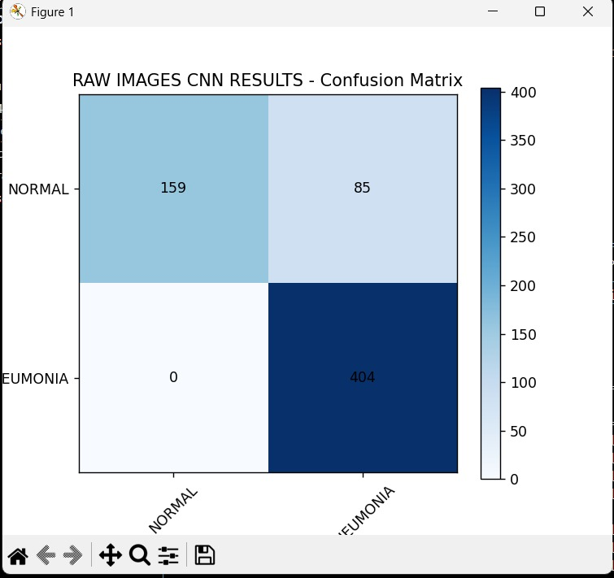
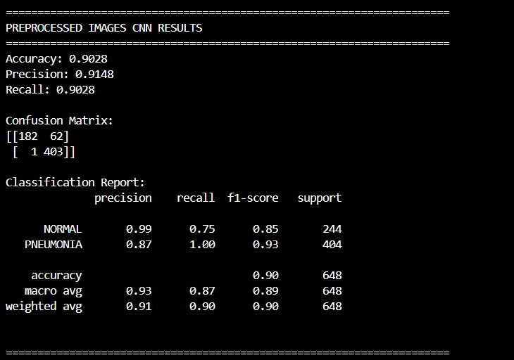
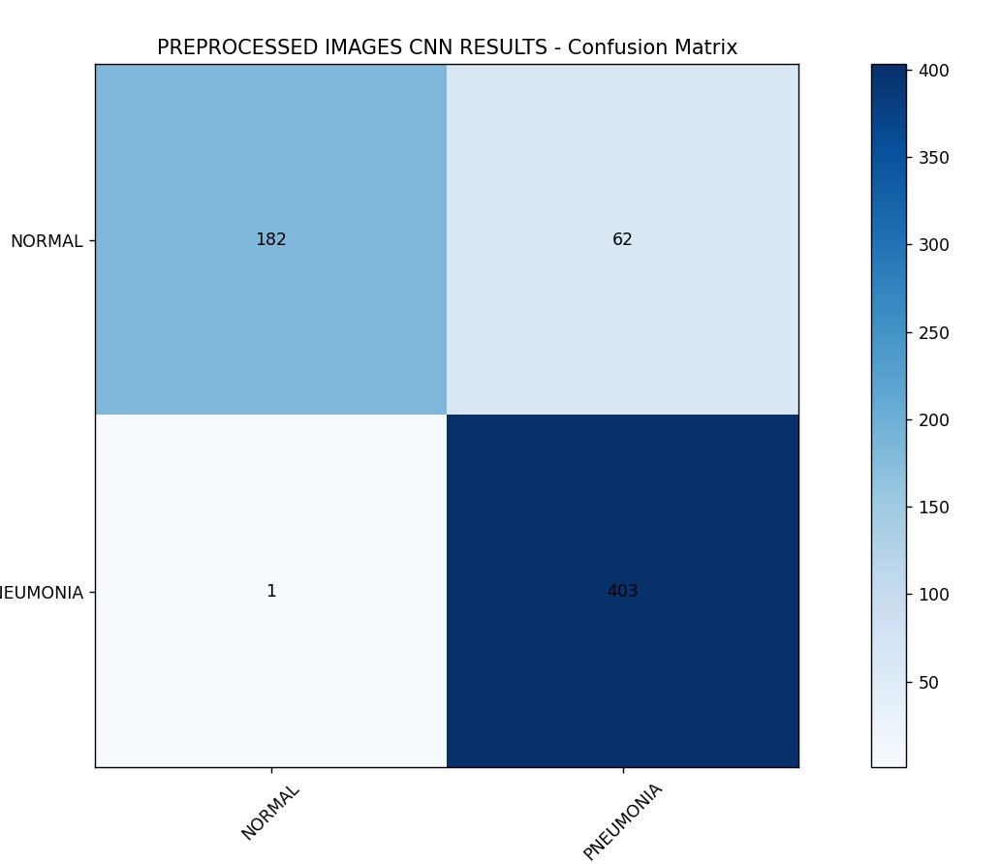

# Chest X-ray Pneumonia Classification

This repository contains a biomedical image informatics project for classifying pediatric chest X-ray images as either `NORMAL` or `PNEUMONIA`. The project compares a convolutional neural network trained on raw normalized X-ray images with the same CNN trained on preprocessed images.

The work is organized into two main stages:

1. Classical image processing and feature exploration.
2. CNN-based binary classification using PyTorch.

## Project Overview

Pneumonia can produce visible abnormalities in chest radiographs, but image quality, contrast, patient positioning, and anatomical overlap can make classification challenging. This project explores whether preprocessing improves CNN performance on chest X-ray classification.

The pipeline includes:

- Loading grayscale chest X-ray images from train, validation, and test folders.
- Resizing images to `128 x 128`.
- Normalizing pixel intensities.
- Applying smoothing and contrast enhancement.
- Creating segmentation masks and extracting simple features.
- Training CNN models on raw and preprocessed images.
- Comparing accuracy, precision, recall, classification reports, and confusion matrices.

## Repository Structure

```text
.
|-- Pneumonia_Identification_Biomedica_imaginng
|-- assets/
|   |-- cnn_accuracy_comparison.jpeg
|   |-- final_comparison_table.jpeg
|   |-- preprocessed_classification_results.jpeg
|   |-- preprocessed_confusion_matrix.jpeg
|   |-- raw_classification_results.jpeg
|   `-- raw_confusion_matrix.jpeg
|-- chest_xray/
|   |-- train/
|   |   |-- NORMAL/
|   |   `-- PNEUMONIA/
|   |-- val/
|   |   |-- NORMAL/
|   |   `-- PNEUMONIA/
|   `-- test/
|       |-- NORMAL/
|       `-- PNEUMONIA/
|-- New folder/
|   |-- biomedical_chest_xray_report.docx
|   `-- result and report images
`-- README.md
```

`Pneumonia_Identification_Biomedica_imaginng` is the main Python project script. It currently has no `.py` extension, but it can still be executed with Python.

## Dataset

The dataset is organized into three splits and two classes.

| Split | NORMAL | PNEUMONIA | Total |
|---|---:|---:|---:|
| Train | 3,678 | 4,194 | 7,872 |
| Validation | 858 | 858 | 1,716 |
| Test | 244 | 404 | 648 |

Total image files used by the code: **10,236**.

The folder also contains macOS metadata files such as `.DS_Store` and `__MACOSX`. These are ignored by the script because it only loads image files ending in `.png`, `.jpg`, `.jpeg`, or `.bmp`.

## Preprocessing

Each image is processed through the following steps:

- Convert RGB images to grayscale if needed.
- Resize to `128 x 128`.
- Normalize intensity values to the range `[0, 1]`.
- Apply Gaussian smoothing.
- Enhance contrast using percentile clipping.
- Sharpen the image.
- Generate a threshold-based mask.
- Fill holes and identify connected regions.
- Extract basic features such as mean intensity and segmented area.

The project also visualizes sample images, histograms, normalization effects, filtering, edge detection, segmentation methods, and feature scatter plots.

## Model

The CNN architecture uses three convolutional blocks followed by fully connected layers:

```text
Conv2D -> ReLU -> MaxPool
Conv2D -> ReLU -> MaxPool
Conv2D -> ReLU -> MaxPool
Flatten
Dense -> ReLU -> Dropout
Output
```

Training configuration:

- Image size: `128 x 128`
- Epochs: `10`
- Batch size: `32`
- Optimizer: Adam
- Learning rate: `0.001`
- Loss function: Cross-entropy loss
- Framework: PyTorch

Two experiments are run:

1. CNN trained on raw normalized images.
2. CNN trained on preprocessed images.

## Results

According to the project report, preprocessing improved overall classification performance.

| Experiment | Accuracy | Precision | Recall |
|---|---:|---:|---:|
| Raw Images | 0.8688 | 0.8916 | 0.8688 |
| Preprocessed Images | 0.9028 | 0.9148 | 0.9028 |

Confusion matrix summary:

| Model | TN | FP | FN | TP |
|---|---:|---:|---:|---:|
| Raw Images | 159 | 85 | 0 | 404 |
| Preprocessed Images | 182 | 62 | 1 | 403 |

The preprocessed model reduced the number of `NORMAL` images incorrectly classified as `PNEUMONIA`, while maintaining strong pneumonia detection.

### Result Images

#### Final Comparison



#### Accuracy Curves



#### Raw Image Model





#### Preprocessed Image Model





## Requirements

Install the required Python packages:

```bash
pip install numpy matplotlib scipy imageio torch scikit-learn scikit-image
```

## How to Run

1. Clone the repository.
2. Make sure the dataset is located at:

```text
chest_xray/
```

3. Update the `DATASET_PATH` variable in `Pneumonia_Identification_Biomedica_imaginng` if needed:

```python
DATASET_PATH = r"path/to/chest_xray"
```

4. Run the script:

```bash
python Pneumonia_Identification_Biomedica_imaginng
```

After training, the script saves two model weight files:

```text
cnn_raw_images_pytorch.pth
cnn_preprocessed_images_pytorch.pth
```

## Project Report

The detailed report is included in:

```text
New folder/biomedical_chest_xray_report.docx
```

It documents the problem description, dataset summary, preprocessing experiments, CNN architecture, evaluation results, confusion matrices, and final conclusions.

## Contributors

- Martina Alfred Aniss
- Jana Mohamed El Saeed
- Fatma Mostafa Abd Al Galeil
- Mahmoud Mohamed Mahmoud
- Mohamed Ibrahim Mohamed Bakri
- David Wagiuh Wadie

## Disclaimer

This project is for educational and research purposes only. It is not intended for clinical diagnosis or medical decision-making.
